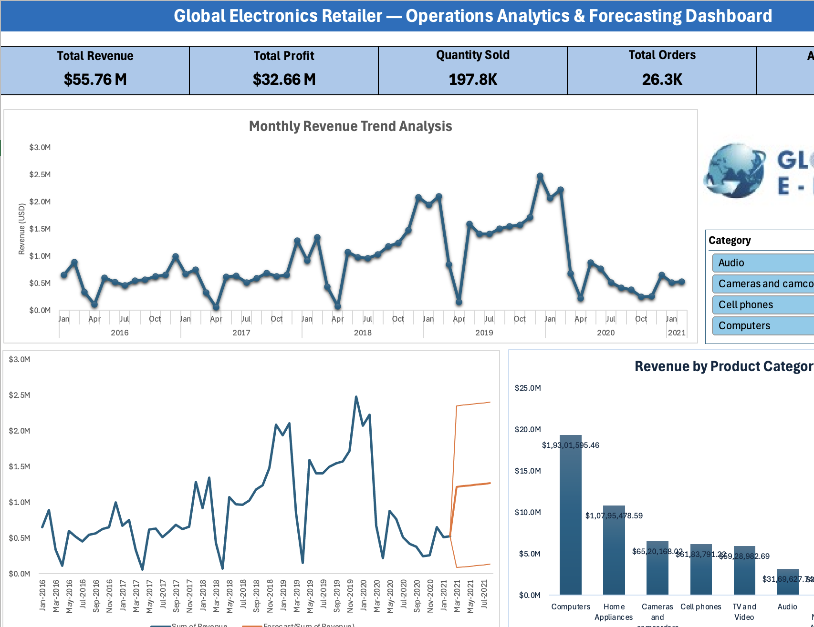

# Retail Operations Analytics & Forecasting Dashboard

## Overview
This project focuses on analyzing sales and operational performance data for a global electronics retailer using Microsoft Excel. The dashboard was built to track important business KPIs, understand revenue trends across product categories, and forecast future sales performance using historical data.

---

## Objective
The main goal of this project was to create an interactive dashboard that helps in:
- monitoring overall business performance,
- identifying high-performing product categories,
- analyzing monthly revenue trends,
- and predicting future sales using forecasting techniques.

---

## Tools Used
- Microsoft Excel
- Pivot Tables & Pivot Charts
- KPI Cards
- Slicers and Timeline Filters
- ETS Forecasting
- Excel Data Visualization Techniques

---

## Dashboard Highlights
- Interactive KPI section for Revenue, Profit, Quantity Sold, Orders, and Average Order Value
- Monthly revenue trend analysis
- Product category-wise revenue comparison
- Interactive filtering using slicers and timeline controls
- Forecasting model to estimate future revenue trends

---

## Key Findings
- Revenue growth was consistent from 2018 to 2019
- A noticeable decline in sales performance can be observed during 2020
- Forecasting suggests a gradual recovery trend in future periods
- Computers and Home Appliances were among the top-performing product categories

---

## Dashboard Preview

---

## Project Files
- Excel Dashboard Workbook
- Forecasting Analysis Sheet
- Dashboard Preview Image
